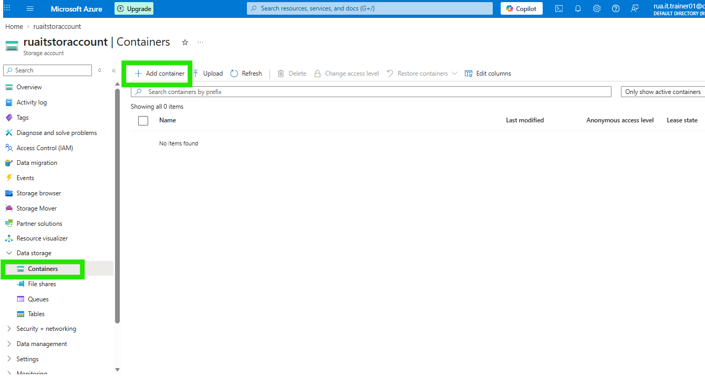
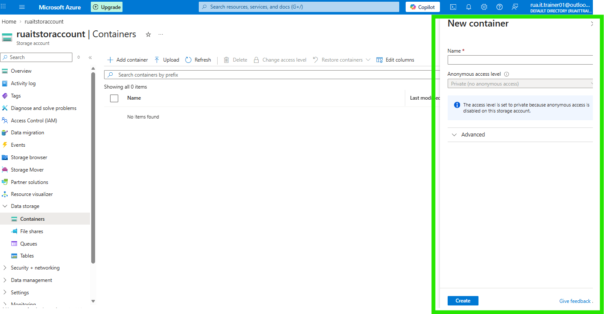
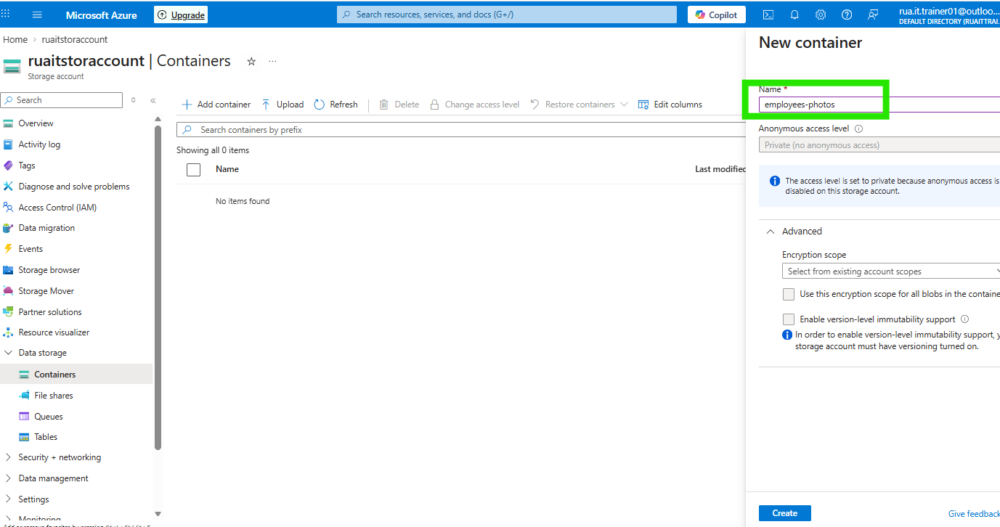
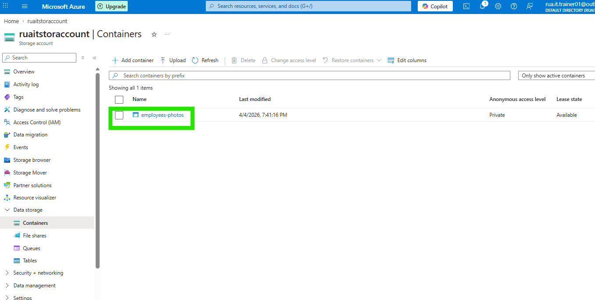
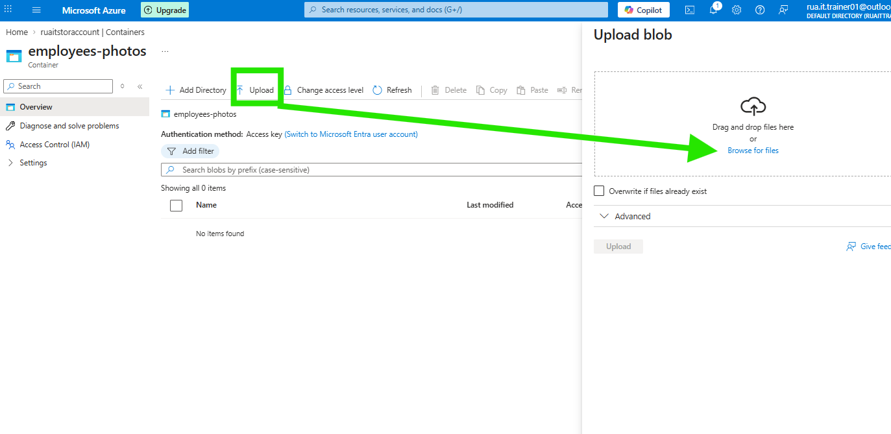
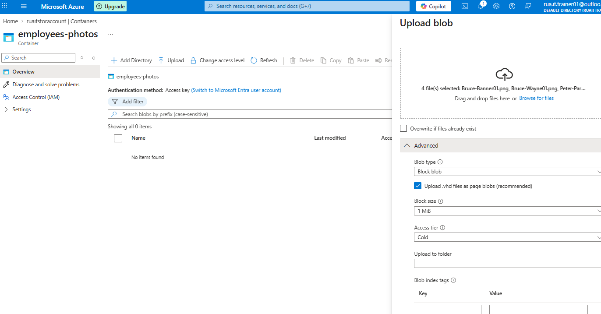
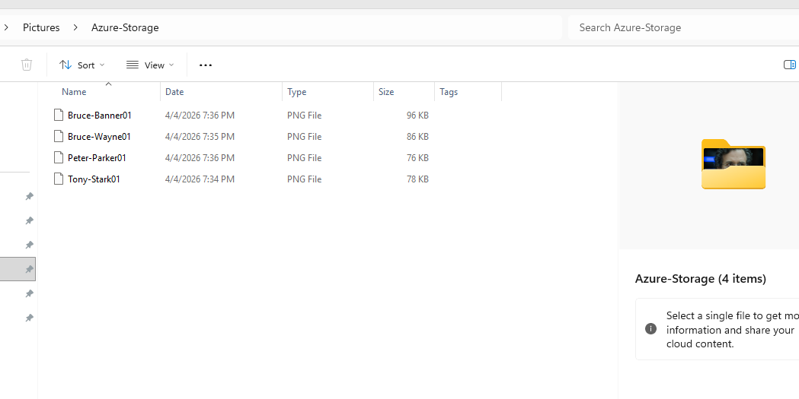
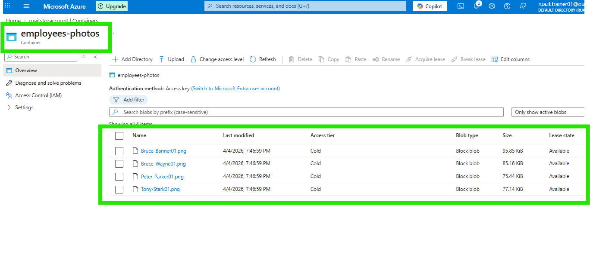
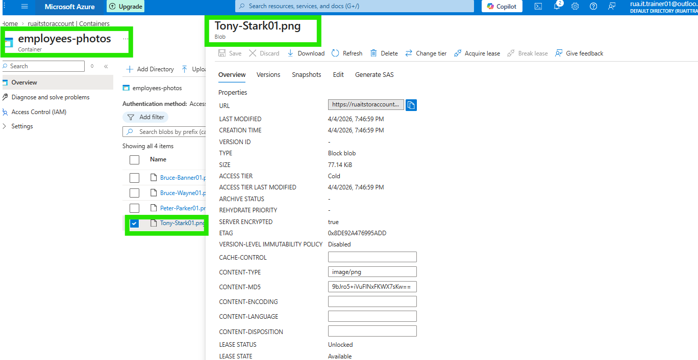

### ⚙️ In this exercise I create a dedicated container for file upload storage like photos for employees from the desktop.

#### Container named - Employee-Photos

#### Container named - Employee-Photos Verification

#### Container named - Employee-Photos Verification user - Tony Stark

