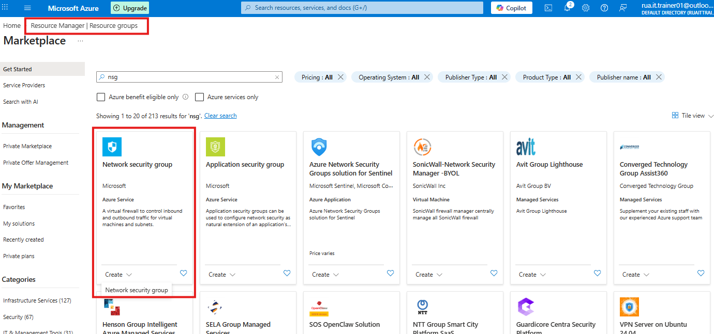
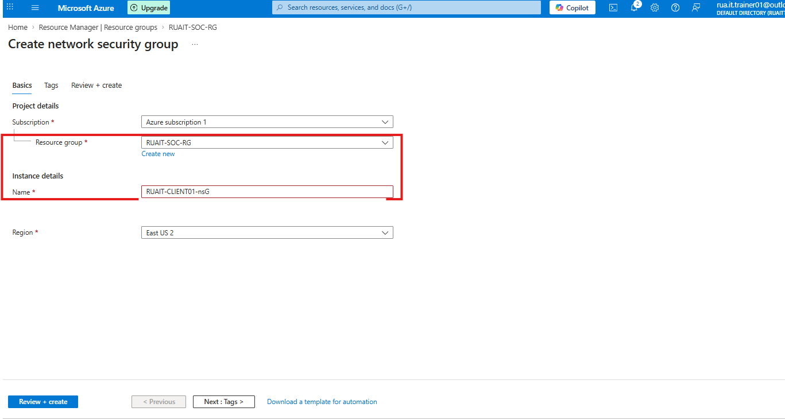

## ⚙️  Create a dedicated Network Security Group (NSG)

In this step I create a new NSG for the new resources group that will be envtually be used for the Virtual Machine

### Step 1 - under the newwly created resource group and manager - click on CREATE >> select new Network Resource Group

### Step 2 - Name the network group appropiately - suggestion/pro tip >> keep names the same in order to keep track.

### Step 3 - Review the newly created NSG dashboard and options given.

