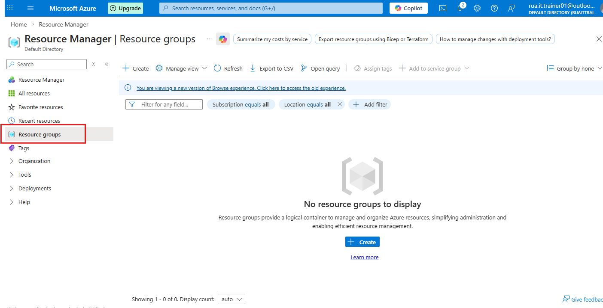
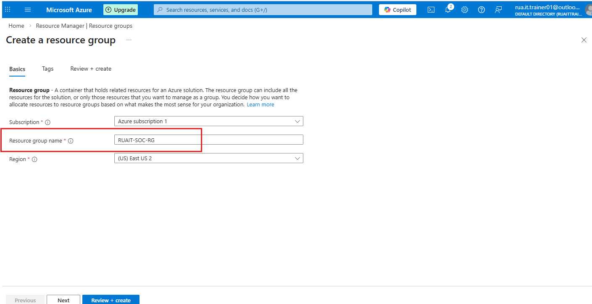
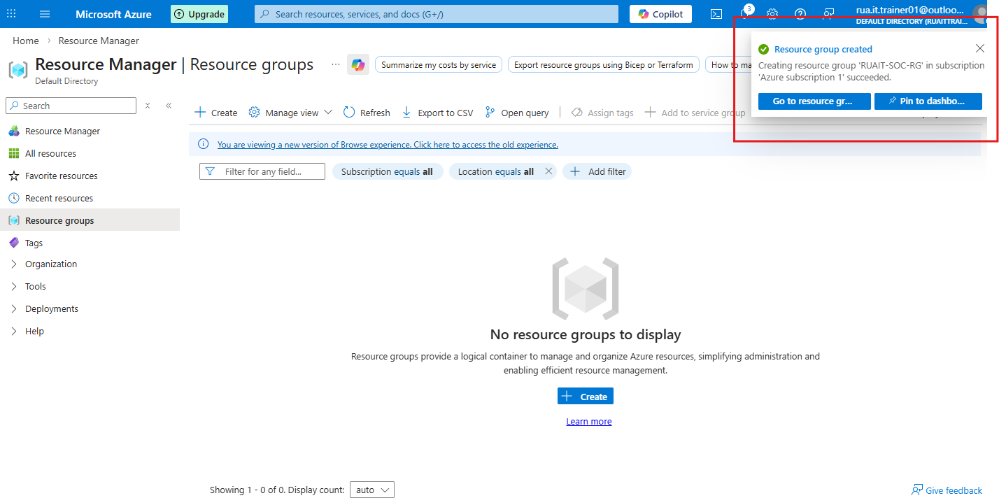
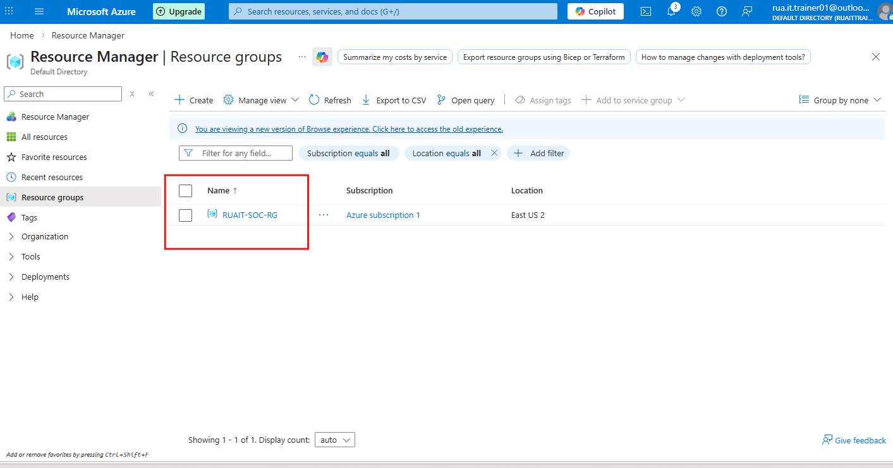

### 🛡️Step 1 - Create a dedicated Resource Group
The objective is to create a dedicated resource group for new tenant and start creating VMs.

Step 1 - Under home - Select Create Resource group

Step 2 - Name resource group >>> RUAIT-SOC-RG

Verification - the resource group RUAIT-SOC-RG was created succesfully.

