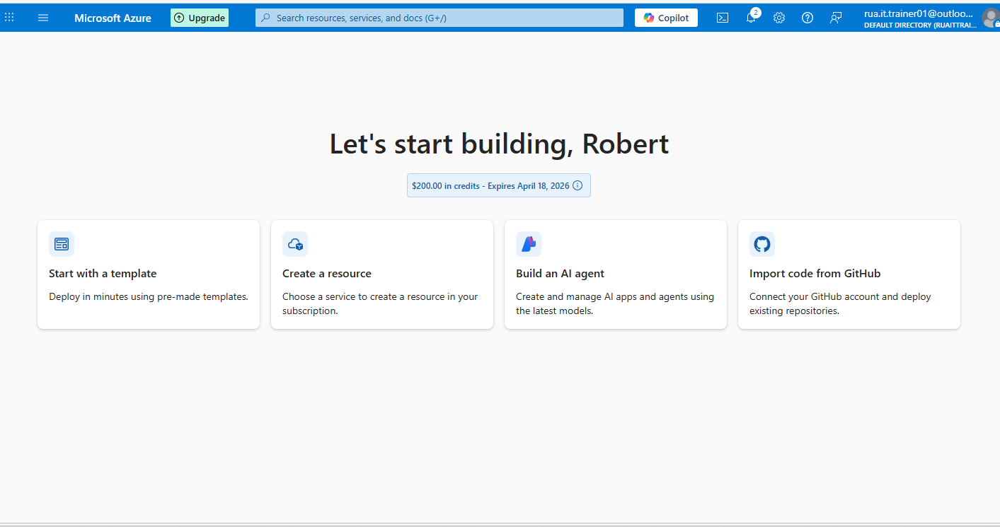
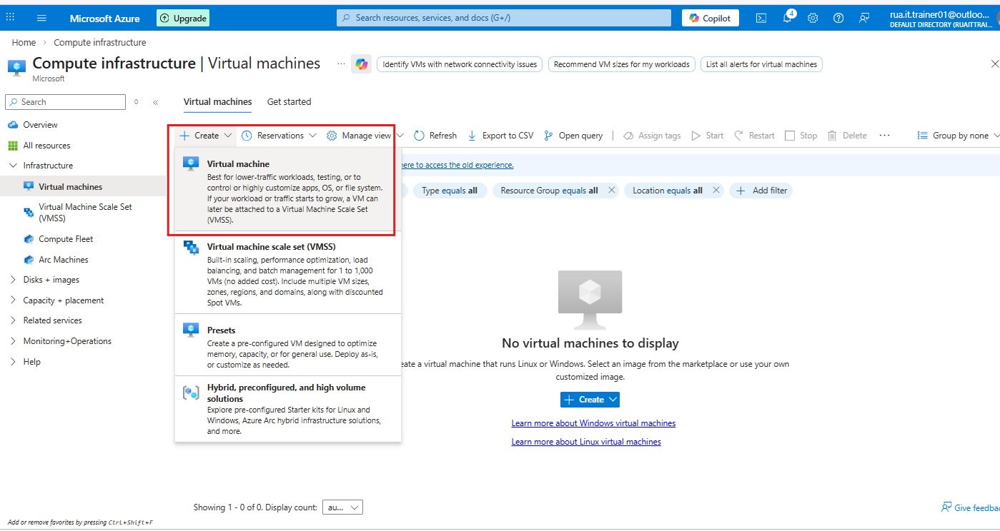
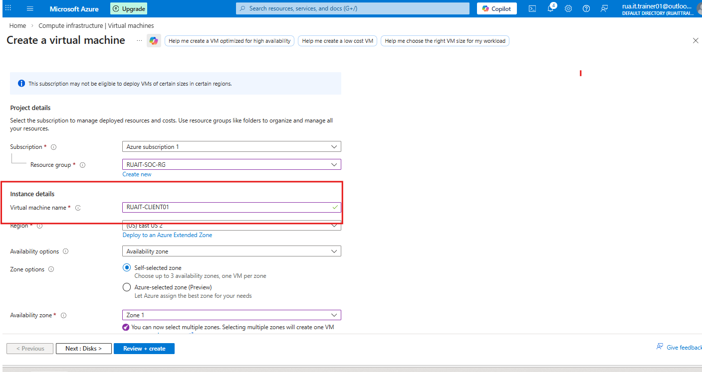
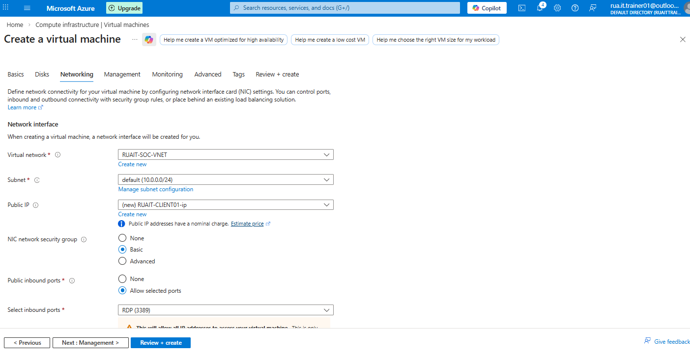
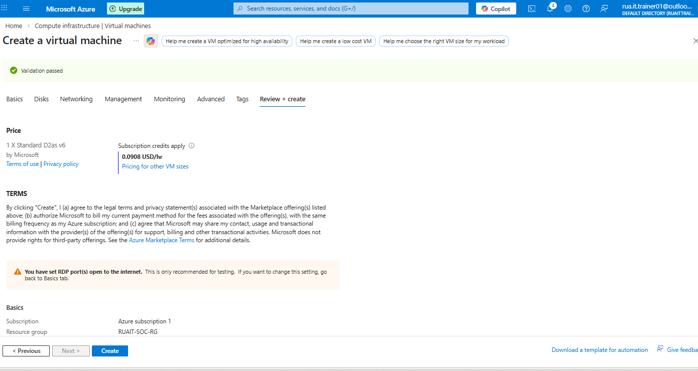
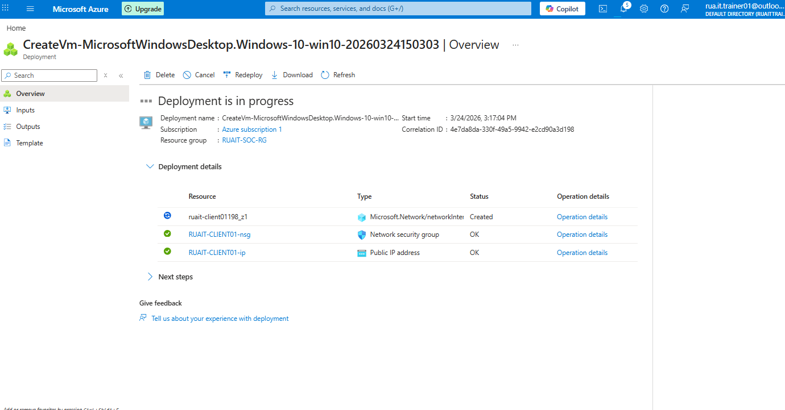
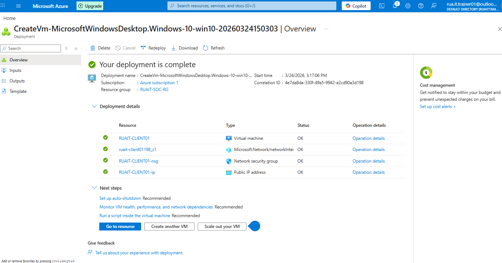

## ⚙️  Create a New Virtual Machine 

### Step 1 - Create a new virtual machine

### Select Virtual Machine 

### Step 2 - Choose a dedicated Name and assign to proper RG

### Step 3 - Choose a Virtual Network

### Step 3 - Review and Create

### Status ###

### Verification - Virtual Machine creation along with associated resources.

