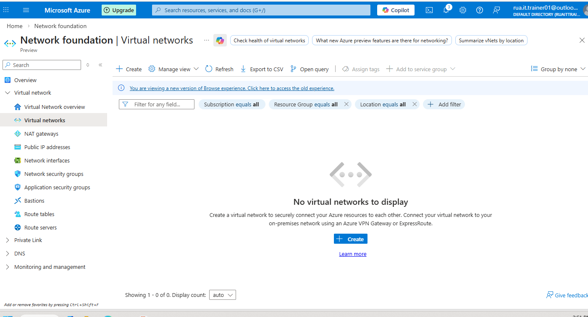
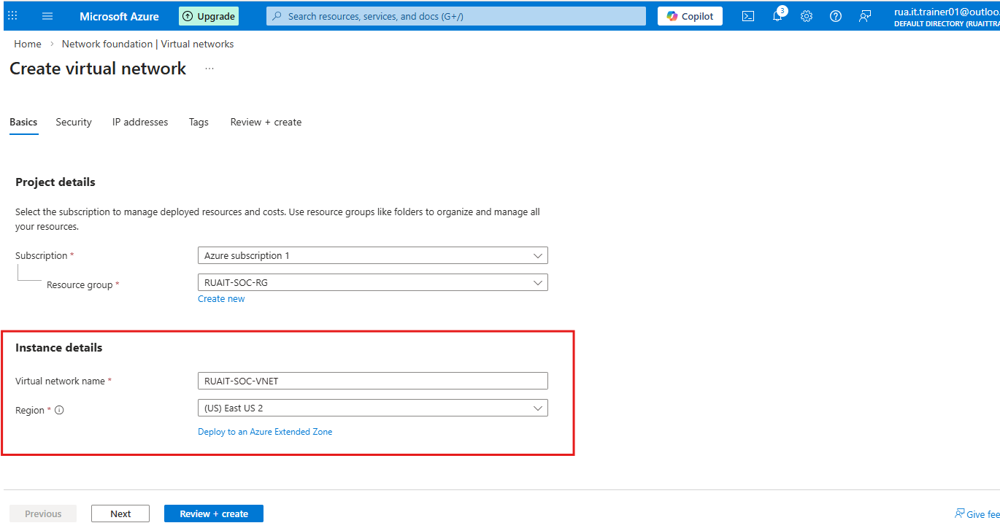
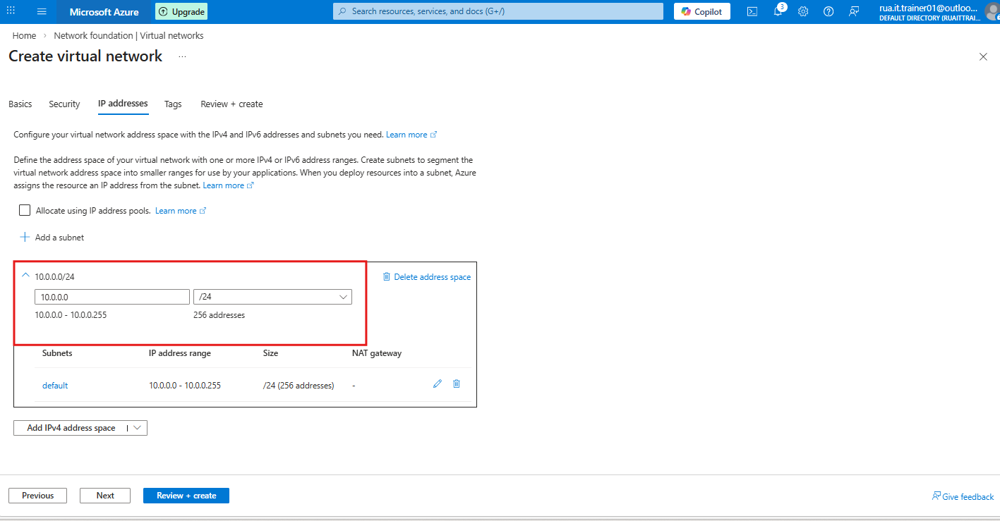
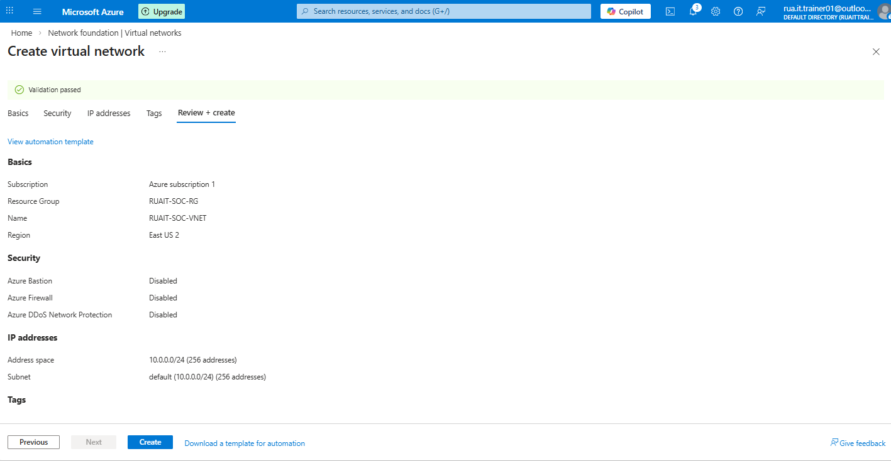
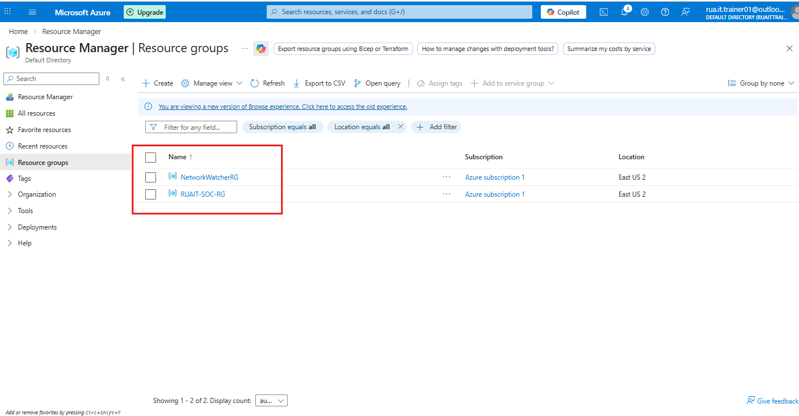

## 🛡️ Create a Virtual Network for Resource Group

The objective is to create a dedicated VNET for new tenant and start creating VMs.

### Step 1 - Withing Network foundation >> virtual networks >> create

### Step 2 - Name and create instance details

### Step 3 - Select a Vlan range that works and viable

### Step 4 - Review and Create

### Verification - the resource group RUAIT-SOC-RG was created succesfully.

